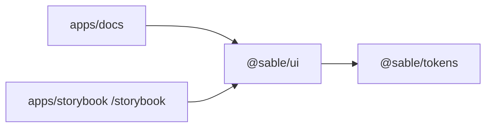

# Sable

Design system para **produtos operacionais**: formulários densos, tabelas, settings. Dark-first. O visitante abre as **docs**, não o GitHub.



| Pacote | Função |
| --- | --- |
| `@sable/tokens` | Cor, tipo, espaço 4px, density, motion |
| `@sable/ui` | Componentes (source TS, sem npm no MVP) |
| `apps/docs` | Demo principal |
| `apps/storybook` | Estados isolados |

## Por que existe

Produtos internos precisam de densidade, foco visível e padrões de página — não de mais um skin zinc+blue do shadcn. Sable congela isso: terracotta, IBM Plex, `comfortable` / `compact`, patterns copy-paste.

## Local

Node 22, pnpm 10.

```bash
pnpm install
pnpm dev:docs        # http://localhost:3000
pnpm dev:storybook   # http://localhost:6006
pnpm typecheck && pnpm test && pnpm build
```

O build exporta as docs em `apps/docs/out` e copia o Storybook para `apps/docs/out/storybook`.

## Usar no workspace

```ts
import { Button } from "@sable/ui";
```

```css
@import "tailwindcss";
@source "../../../packages/ui/src/**/*.{ts,tsx}";
@import "@sable/tokens/theme.css";
```

`html` com `data-theme="dark" | "light"` e `data-density="comfortable" | "compact"`.

## Deploy (Cloudflare Pages)

- Framework: Next.js (Static HTML Export)
- Build: `pnpm install && pnpm build`
- Output: `apps/docs/out`
- Node: 22

Storybook: `https://<projeto>.pages.dev/storybook/`
